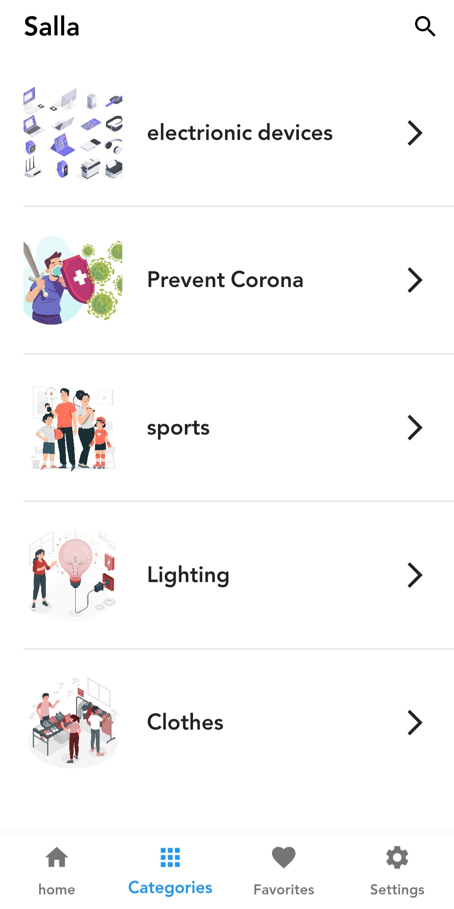

# Salla

Introducing Salla, an innovative and user-friendly e-commerce showcase app designed for seamless product exploration and a delightful shopping experience.

## Features

- **User-Friendly Interface:** Salla boasts a sleek and intuitive design, ensuring a seamless and enjoyable browsing experience. With a clean layout, users can effortlessly navigate through various products and categories.

- **Product Showcase:** Dive into a visually appealing product showcase that beautifully displays an array of items. Users can explore different categories and discover an extensive range of products, each accompanied by detailed descriptions and high-quality images.

- **User Authentication:** Prioritizing security and personalization, Salla incorporates a robust user authentication system. Users can easily sign up for an account, securely log in, and enjoy personalized features tailored to their preferences.

- **Profile Management:** Salla goes beyond a simple showcase app by offering users the ability to manage their profiles. With an easy-to-use profile editing feature, users can update their information, ensuring a personalized and up-to-date experience.

- **Favorites Functionality:** Elevating the user experience, Salla allows customers to curate their own wishlists. The "Add to Favorites" feature enables users to bookmark products they love, creating a personalized collection for future reference.

- **Responsive Design::** Whether accessed on a smartphone or tablet, Salla's responsive design ensures a consistent and enjoyable experience across various devices. The app adapts seamlessly to different screen sizes, providing users with flexibility and convenience.

## Screenshots

  
 

## Getting Started

To get started with the Salla app, follow these steps:

1. **Prerequisites:** Ensure you have Flutter installed on your system. If not, you can install it from the official Flutter website.

2. **Clone the Repository:** Clone this repository to your local machine.

3. **Install Dependencies:** Navigate to the project directory and install the required dependencies.

4. **Run the App:** Now, you can run the app on your connected device or emulator.

## Contact

If you have any questions or suggestions regarding Salla app, feel free to contact us at yaman.almobayed@hotmail.com
